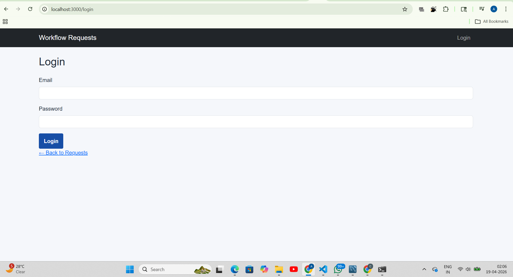
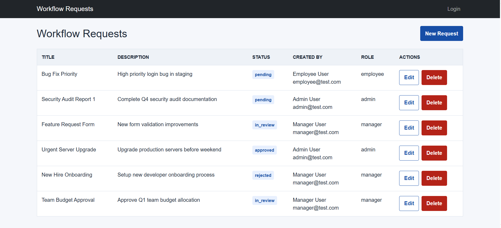
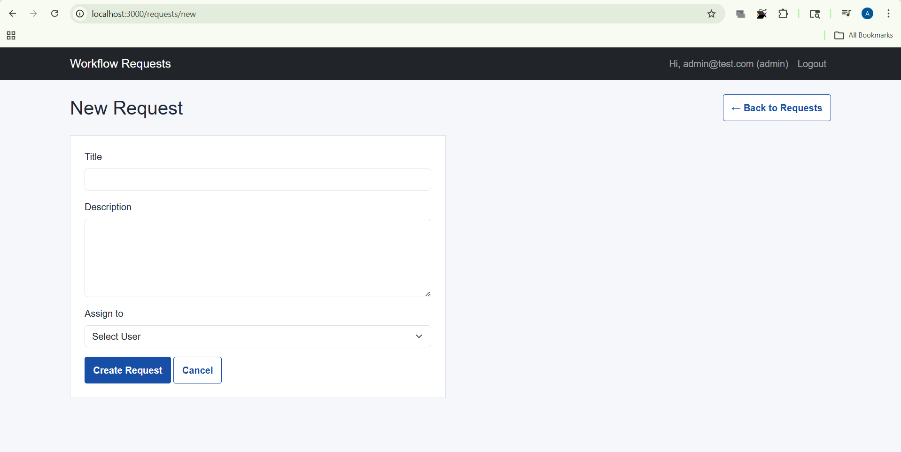
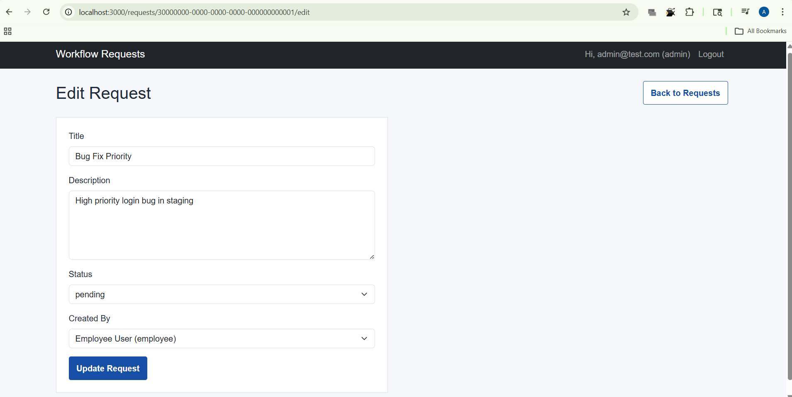

# Workflow Requests App

A modular Node.js and Express application for managing workflow requests with session-based authentication, role-based authorization, MySQL persistence, EJS views, and Bootstrap-powered client-side validation.

## Screenshots

Add screenshots here before submission.

### Login Page

 

### Requests Listing

 


### New Request Form

 


### Edit Request Form

 


## Overview

This project is a server-rendered workflow request management system built using the MVC pattern. It allows authenticated users to log in and manage workflow requests depending on their assigned role.

Key capabilities:

- session-based login and logout
- role-aware request management
- create, view, edit, and delete request workflows
- client-side form validation using Bootstrap validation classes and custom JavaScript
- modular architecture using routes, controllers, services, models, middleware, and configuration files

The application was refactored for improved code quality and maintainability without changing the core functionality.

## Tech Stack

- Backend: Node.js
- Framework: Express.js
- View Engine: EJS with `ejs-mate`
- Database: MySQL
- Authentication: `express-session` with password verification via `bcryptjs`
- Frontend Styling: Bootstrap 5 + custom CSS
- Client-side Validation: Bootstrap validation pattern with JavaScript in `public/js/script.js`
- Environment Management: `dotenv`

## Project Structure

```text
Quoqo_assignment_option_B/
|-- app.js
|-- server.js
|-- package.json
|-- .env
|-- Readme.md
|-- config/
|   `-- db.js
|-- constants/
|   `-- appConstants.js
|-- controllers/
|   |-- authController.js
|   |-- errorController.js
|   `-- requestController.js
|-- middleware/
|   |-- auth.js
|   `-- locals.js
|-- models/
|   |-- requestModel.js
|   `-- userModel.js
|-- routes/
|   |-- authRoutes.js
|   |-- index.js
|   `-- requestRoutes.js
|-- services/
|   |-- authService.js
|   `-- requestService.js
|-- utils/
|   |-- ExpressError.js
|   `-- wrapasync.js
|-- views/
|   |-- edit.ejs
|   |-- error.ejs
|   |-- login.ejs
|   |-- new.ejs
|   |-- requests.ejs
|   |-- layout/
|   |   `-- boilerplate.ejs
|   `-- partials/
|       `-- alert.ejs
|-- public/
|   |-- css/
|   |   `-- style.css
|   `-- js/
|       `-- script.js
`-- init/
    |-- schema.sql
    `-- seed.sql
```

## Prerequisites

Make sure the following are installed on your machine:

- Node.js 18+ recommended
- npm
- MySQL Server
- Git

Optional but useful:

- nodemon for local development
- MySQL Workbench or any SQL client

## Getting Started

### 1. Clone the repository

```bash
git clone <your-repository-url>
cd Quoqo_assignment_option_B
```

### 2. Install dependencies

```bash
npm install
```

### 3. Configure environment variables

Create a `.env` file in the project root and add your database configuration.

Example:

```env
DB_HOST=localhost
DB_USER=your_mysql_username
DB_PASSWORD=your_mysql_password
DB_NAME=workflow_db
SESSION_SECRET=replace_with_a_secure_random_value
PORT=3000
NODE_ENV=development
```

Notes:

- `DB_NAME` must match the database you create in MySQL.
- `SESSION_SECRET` should be a strong random string in real deployments.
- `NODE_ENV=development` is useful while developing because error messages are more descriptive.

### 4. Set up the database

Create the database in MySQL:

```sql
CREATE DATABASE workflow_db;
```

Run the schema file:

```bash
mysql -u your_mysql_username -p workflow_db < init/schema.sql
```

If you want demo users and demo workflow requests, update the `USE your_db_name;` line inside `init/seed.sql` to your real database name, then run:

```bash
mysql -u your_mysql_username -p workflow_db < init/seed.sql
```

Seeded test users:

- `admin@test.com` / `password`
- `manager@test.com` / `password`
- `employee@test.com` / `password`

### 5. Run the application

Use the server entrypoint:

```bash
npm start
```

Or:

```bash
node server.js
```

Open the app in your browser:

```text
http://localhost:3000
```

## Environment Variables

The application reads configuration from `.env`.

| Variable | Required | Description |
|---|---|---|
| `DB_HOST` | Yes | MySQL host name, usually `localhost` |
| `DB_USER` | Yes | MySQL username |
| `DB_PASSWORD` | Yes | MySQL password |
| `DB_NAME` | Yes | Database name used by the app |
| `SESSION_SECRET` | Recommended | Secret used by `express-session` |
| `PORT` | Optional | Port number for the Node.js server |
| `NODE_ENV` | Optional | Controls environment mode such as `development` or `production` |

## Available Scripts

| Script | Command | Description |
|---|---|---|
| `start` | `npm start` | Starts the application using `server.js` |
| `test` | `npm test` | Placeholder script currently not configured with test cases |

Recommended local dev command if using nodemon:

```bash
nodemon server.js
```

## API / Route Overview

This project is server-rendered, so routes return EJS pages and redirects rather than JSON APIs.

### Public Routes

| Method | Route | Description |
|---|---|---|
| `GET` | `/` | Redirects to `/requests` |
| `GET` | `/login` | Renders the login page |
| `POST` | `/login` | Authenticates the user and creates a session |

### Authenticated Routes

| Method | Route | Description | Access |
|---|---|---|---|
| `POST` | `/logout` | Destroys the current session | Logged-in users |
| `GET` | `/requests` | Displays all workflow requests | Public |
| `GET` | `/requests/new` | Renders the create request form | Logged-in users |
| `POST` | `/requests` | Creates a new request | Logged-in users |
| `GET` | `/requests/:id/edit` | Renders edit form | `admin`, `manager` |
| `POST` | `/requests/:id/edit` | Updates a request | `admin`, `manager` |
| `POST` | `/requests/:id/delete` | Deletes a request | `admin` |

## Authentication

Authentication is implemented using sessions.

### Login Flow

1. User opens `/login`
2. User submits email and password
3. Password is verified against the hashed password stored in MySQL using `bcryptjs`
4. On success, session data is stored:
   - `userId`
   - `userRole`
   - `userEmail`
5. User is redirected to the original protected route or to `/requests`

### Logout Flow

1. User submits the logout form
2. Session is destroyed
3. Session cookie is cleared
4. User is redirected to `/requests`

### Authorization Rules

- `employee`
  - can log in
  - can view requests
  - can create requests
  - cannot edit or delete requests

- `manager`
  - can log in
  - can view requests
  - can create requests
  - can edit requests
  - cannot delete requests

- `admin`
  - can log in
  - can view requests
  - can create requests
  - can edit requests
  - can delete requests

### Client-side Validation

Bootstrap validation is applied to:

- login form
- new request form
- edit request form

Validation behavior is implemented in:

- [public/js/script.js](./public/js/script.js)

## Folder Reference

### `app.js`

Builds and configures the Express application. It mounts middleware, routes, view engine settings, sessions, and error handling. It exports the configured app instead of starting the server directly.

### `server.js`

Application entrypoint. Imports the configured Express app from `app.js` and starts listening on the configured port.

### `config/`

- `db.js`: Creates and exports the MySQL connection pool used across models.

### `constants/`

- `appConstants.js`: Stores route strings, view titles, alert messages, request statuses, and session configuration in one place to reduce duplication.

### `controllers/`

- `authController.js`: Handles login page rendering, login submission, and logout behavior.
- `requestController.js`: Handles listing, creating, editing, and deleting workflow requests.
- `errorController.js`: Centralized application error renderer.

### `middleware/`

- `auth.js`: Session-based authentication and role-check middleware.
- `locals.js`: Exposes session and alert data to all EJS views through `res.locals`.

### `models/`

- `userModel.js`: User-related database operations.
- `requestModel.js`: Request-related database operations.

### `routes/`

- `authRoutes.js`: Authentication endpoints.
- `requestRoutes.js`: Workflow request endpoints.
- `index.js`: Aggregates route modules into a single router.

### `services/`

- `authService.js`: Contains authentication-related business logic such as credential verification and session persistence wrapping.
- `requestService.js`: Contains request validation and request lookup helpers.

### `utils/`

- `wrapasync.js`: Reusable async error wrapper for route handlers.
- `ExpressError.js`: Custom error class with HTTP status support.

### `views/`

Contains all EJS templates used for rendering the UI.

- `login.ejs`: Login page
- `requests.ejs`: Request listing page
- `new.ejs`: New request form
- `edit.ejs`: Edit request form
- `error.ejs`: Error page
- `layout/boilerplate.ejs`: Shared layout wrapper
- `partials/alert.ejs`: Shared alert rendering partial

### `public/`

Static frontend assets.

- `css/style.css`: Custom styles
- `js/script.js`: Client-side Bootstrap validation script

### `init/`

- `schema.sql`: Database schema creation
- `seed.sql`: Demo seed data for users and requests

## Dependencies

### Runtime Dependencies

| Package | Purpose |
|---|---|
| `express` | Web application framework |
| `ejs` | Template rendering |
| `ejs-mate` | Layout support for EJS |
| `mysql2` | MySQL database driver and promise API |
| `express-session` | Session-based authentication |
| `bcryptjs` | Password hashing and verification |
| `dotenv` | Environment variable loading |
| `uuid` | Installed dependency for UUID support |
| `body-parser` | Installed dependency, though Express built-in parsers are currently used |

## Contributing

If you want to improve the project:

1. Fork the repository
2. Create a feature branch
3. Make your changes
4. Test the application locally
5. Open a pull request

Suggested improvement areas:

- add automated tests
- add flash-message middleware
- improve authorization-based UI hiding for actions
- add request ownership rules
- add a development script such as `npm run dev`
- improve styling consistency across all pages

